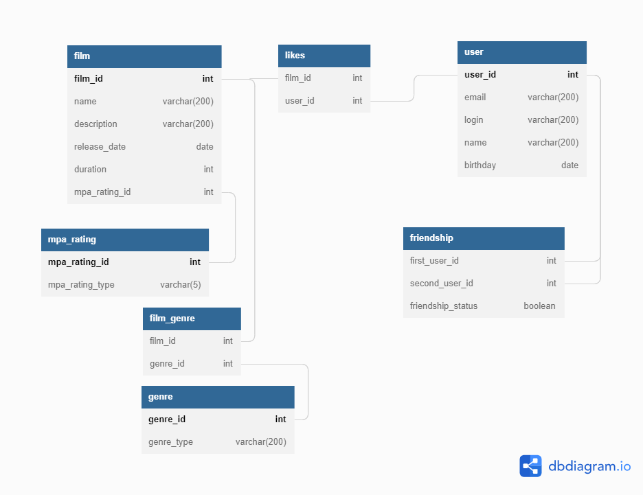

# java-filmorate
Template repository for Filmorate project.

Структура БД:
film - информация о фильме
mpa_rating - таблица, связывающая id рейтинга с его описанием
film_genre - таблица, связывающая id фильма с id его жанров
genre - таблица, связывающая id жанра с его описанием
user - информация о пользователе
friendship - таблица, отображающая добавленных друзей пользователя
likes - информация о лайках, поставленным фильму пользователями

Примеры:
SELECT *
FROM film; // отобразить всю информацию о всех фильмах

SELECT name
FROM film
JOIN film_genre ON film.film_id = film_genre.film_id
JOIN genre ON film_genre.genre_id = genre.genre_id
WHERE genre.genre_type = 'Боевик'; // отобразить названия фильмов с жанром "Боевик"

Код схемы:

Table film {
film_id int [pk, increment]
film_name varchar(200)
description varchar(200)
release_date date
duration int
mpa_rating_id int
}

Table mpa_rating {
mpa_rating_id int [pk, ref: < film.mpa_rating_id]
mpa_rating_type varchar(5)
}

Table film_genre {
film_id int [ref: > film.film_id]
genre_id int
}

Table genre {
genre_id int [pk, increment, ref: < film_genre.genre_id]
genre_type varchar(200)
}

Table user {
user_id int [pk, increment]
email varchar(200)
login varchar(200)
user_name varchar(200)
birthday date
}

Table friendship {
first_user_id int [ref: > user.user_id]
second_user_id int [ref: > user.user_id]
}

Table likes {
film_id int [ref: > film.film_id]
user_id int [ref: > user.user_id]
}