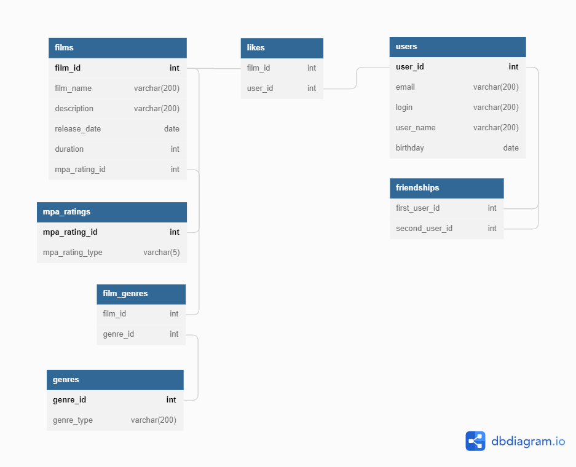

# java-filmorate
Template repository for Filmorate project.

Структура БД:
film - информация о фильме
mpa_rating - таблица, связывающая id рейтинга с его описанием
film_genre - таблица, связывающая id фильма с id его жанров
genre - таблица, связывающая id жанра с его описанием
user - информация о пользователе
friendship - таблица, отображающая стаус дружбы (true - дружба, false - непринятый запрос на дружбу)
likes - информация о лайках, поставленным фильму пользователями

Примеры:
SELECT *
FROM film; // отобразить всю информацию о всех фильмах

SELECT name
FROM film
JOIN film_genre ON film.film_id = film_genre.film_id
JOIN genre ON film_genre.genre_id = genre.genre_id
WHERE genre.genre_type = 'Боевик'; // отобразить названия фильмов с жанром "Боевик"

